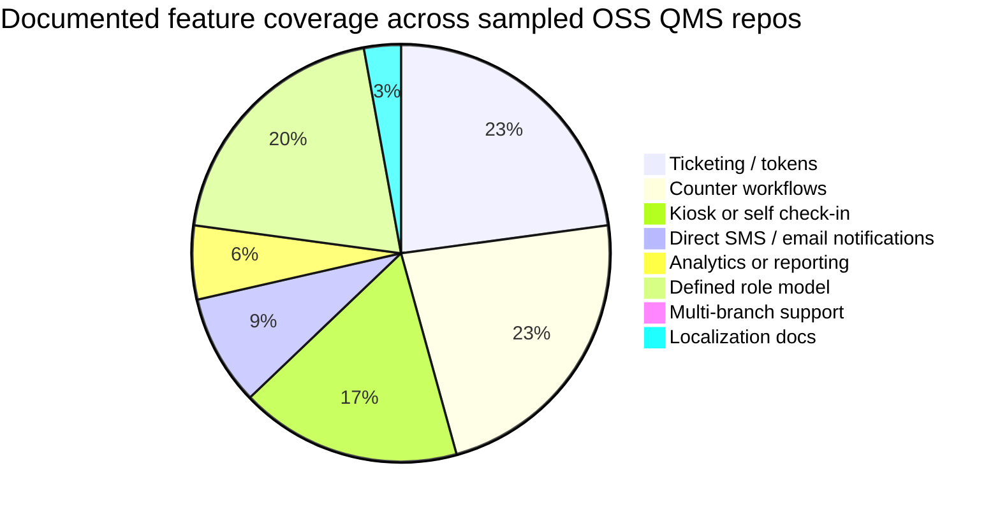
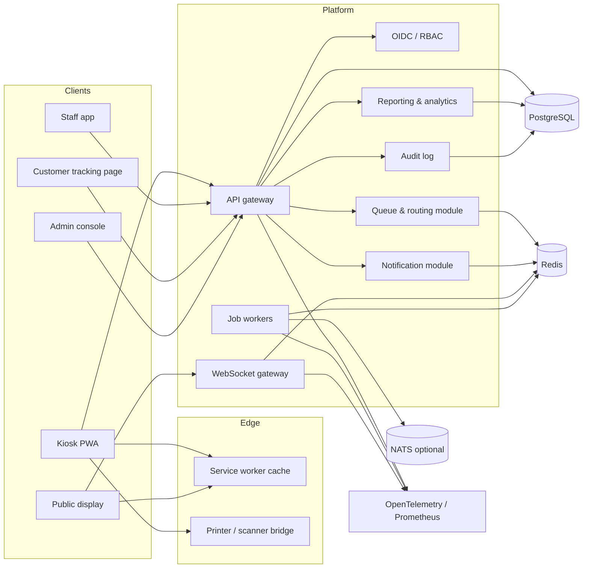
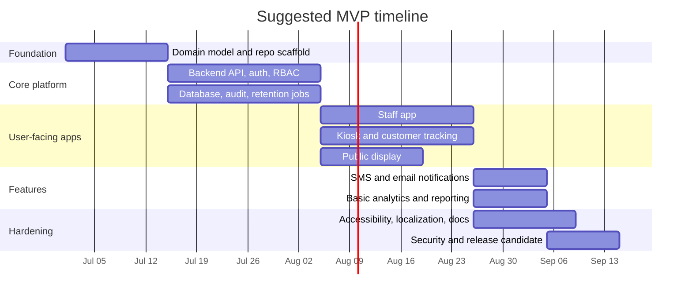

# Building an Open-Source Queue Management System

## Executive summary

The open-source queue-management landscape is real, but fragmented. The strongest reusable codebase I found is **FQM** (`mrf345/FQM`), which is feature-rich for a queue app and documents POS printing, text-to-speech, QR support, Docker setup, localization hooks, and a public site; it also has the largest visible community footprint among the directly relevant repos reviewed. Around it sits a long tail of narrower projects: **Auroqueue** for Raspberry Pi edge deployments, **Qsee** for kiosk/waiting-room displays, **Queue-Management-System** by `yuvisidhu19` for web/SMS/email-based balancing, **Line Me Up** for modern self-service waitlists, and newer hospital-oriented efforts like **EASPATAAL** and **KUSH328/Hospital-Patient-Queue-Management-App**. citeturn49view0turn45search3turn48view0turn12view4turn10view3turn12view2turn18view0turn38search0turn18view6turn42view0turn11view0

What is missing across the ecosystem is more important than what is present. Core queue mechanics are common, but **production-grade multi-branch tenancy, explicit SLA and prioritization rules, compliance documentation, accessibility conformance, offline synchronization, deep analytics, and maintainable contribution processes** are seldom documented. WhatsApp support was not documented in any reviewed queue repo. The practical gap is clear: there is room for a **serious, self-hostable OSS QMS** that treats queueing not as a demo, but as a real operational platform. citeturn49view0turn48view0turn10view3turn18view2turn18view0turn18view6turn42view0turn11view0

For a new GitHub-hosted project, the best technical path is a **modular monolith** first: one backend deployable with well-separated queue, routing, notification, reporting, and identity modules; a **React + Vite PWA** frontend family for staff, kiosk, display, and customer views; **PostgreSQL** as the system of record with **row-level security** for multi-tenant isolation; **Redis** for caching and jobs; **WebSockets** for real-time call/display updates; and **Docker Compose** for local development and small installations, with **Kubernetes + Helm** as the scale-up path. That design keeps the first release understandable while leaving a clean path to event-driven workers or NATS-backed services later. citeturn25search0turn25search4turn36search0turn36search1turn28search12turn28search0turn25search2turn26search1turn35search4turn35search5turn26search0

My recommendation is to target an initial public release around an **MVP of 22–28 person-weeks**. That MVP should include ticketing, counters, role-based workflows, customer self-check-in, public display, real-time updates, SMS/email notifications, audit logs, branch/location support, basic analytics, Dockerized self-hosting, and strong project hygiene. For licensing, the most pragmatic default is **Apache-2.0** if broad adoption is the primary goal; if monetized hosted SaaS and anti-fork protection matter more, use **AGPLv3 plus a commercial license**. For sustainability, the cleanest progression is **GitHub Sponsors/donations first**, then **paid support and hosted SaaS**, and only then a dual-license program if commercial demand justifies the extra governance overhead. citeturn33search0turn33search10turn33search14turn50search7turn50search11

## Open-source landscape

The reviewed repos cluster into four architectural families. First are **classic full-stack monoliths** such as FQM, `qms-opensource/queuemanagementsystem`, `yuvisidhu19/Queue-Management-System`, and `RicardVillalba/Qhops`, which bundle queue logic, views, and persistence in one codebase. Second are **frontend-heavy real-time apps on BaaS**, such as **Qsee** on Firebase and **Line Me Up** on Supabase. Third are **edge/device-centric systems**, such as **Auroqueue**, which assumes a Raspberry Pi, GPIO/button ticket handout, a TV, and desks on the local network. Fourth are **newer TypeScript-first apps** like **EASPATAAL** and **KUSH328**, which move toward more modern dashboards, portals, and richer staff workflows. citeturn49view0turn18view2turn18view0turn18view4turn10view3turn18view6turn48view0turn42view0turn11view0

The maturity curve is uneven. **FQM** is the most established OSS queue project from the set I could verify: public website, multiple releases, Docker guidance, printer support, TTS, QR support, migration notes, and localization guidance. **Auroqueue** and **Qsee** are elegant proofs of concept for specific deployment styles, but both are older. **Line Me Up** and **EASPATAAL** look closer to the direction a modern OSS QMS should take, but still show smaller community footprints and thinner ops/compliance documentation than a production buyer or self-hoster would typically expect. citeturn49view0turn45search0turn44search2turn48view0turn10view3turn18view6turn42view0

### Repository inventory

| Repository | Platform | Scope | Stars | License | Main languages / stack | Last visible activity | Demo or official site |
|---|---|---:|---:|---|---|---|---|
| `mrf345/FQM` citeturn49view0turn45search3 | GitHub | Mature web-based queue manager with POS USB printing, TTS, QR, Docker | 129 | MPL-2.0 | JavaScript, Python, HTML, CSS citeturn49view0 | Updated **Feb 25, 2026**; latest release **Sep 14, 2020** citeturn45search3turn49view0turn45search0 | `fqms.github.io` citeturn49view0 |
| `2color/auroqueue` citeturn48view0turn12view4 | GitHub | Raspberry Pi paperless queue system with token button, desks, screen, Docker | 54 | No license surfaced in parsed repo metadata | JavaScript, CSS, HTML, Shell, Dockerfile citeturn48view0 | Last commit **Nov 17, 2023** citeturn12view4 | No public demo listed; meetup talk linked in README citeturn48view0 |
| `StuDownie/Qsee` citeturn10view3turn12view2 | GitHub | Realtime customer kiosk, agent screen, waiting-room display, Web Speech | 8 | GPL-3.0 | Nuxt.js, Firebase, Buefy / Vue stack citeturn10view3 | Last commit **Apr 24, 2019** citeturn12view2 | Demo site listed in README citeturn10view3 |
| `qms-opensource/queuemanagementsystem` citeturn18view2turn12view3 | GitHub | Hospital/clinic QMS with SMS and staff roles | 16 | No license surfaced in parsed repo metadata | Laravel, MySQL, jQuery / PHP stack citeturn18view2 | Last commit **Oct 21, 2019** citeturn12view3 | No demo listed citeturn18view2 |
| `yuvisidhu19/Queue-Management-System` citeturn18view0turn18view1turn38search0 | GitHub | Web QMS with dynamic queue balancing, QR self-registration, SMS + email | 40 | MIT | Python, HTML, Django citeturn18view1turn38search0 | Updated **Jul 26, 2025** citeturn38search0 | README points to localhost pages only citeturn18view0 |
| `calvincchan/line-me-up` citeturn18view6turn40search0 | GitHub | Restaurant/retail self-service waitlist with kiosk, own-device join, public screen | 5 | No license surfaced in parsed repo metadata | TypeScript, PLpgSQL, HTML, Shell citeturn40search0 | Activity date not exposed in parsed HTML; public announcement **Sep 24, 2024** citeturn17search8turn40search4 | Intro video + project blog post citeturn18view6turn40search4 |
| `gaureshpai/easpataal` citeturn42view0 | GitHub | Modern hospital QMS with staff dashboards, patient portal, display management | 15 | MIT | TypeScript, CSS, JavaScript | Archived **Dec 13, 2025**; latest release **Oct 21, 2025** citeturn42view0turn43search2 | Vercel deployment listed in repo metadata citeturn42view0 |
| `KUSH328/Hospital-Patient-Queue-Management-App` citeturn11view0 | GitHub | Prototype hospital queue app with live dashboard, SMS, analytics, Excel storage | 1 | No license surfaced in parsed repo metadata | TypeScript, CSS, JavaScript | Activity date not exposed in parsed HTML | Preview deployment listed in README citeturn11view0 |
| `worinium/QMS-APP` citeturn42view1 | GitHub | Desktop + web customer queue app using WPF, Vue, PostgreSQL | 2 | MIT | C# | Activity date not exposed in parsed HTML | No demo listed citeturn42view1 |

GitLab produced far fewer directly relevant public results during this review. The clearest example was **`EIP EWI / Queue`**, a lab/helpdesk queue project under **GNU AGPLv3**, created on **Sep 20, 2023** and showing commit history links in public HTML, but not enough unauthenticated metadata for an apples-to-apples inventory row here. citeturn8view0turn9search3

## Feature comparison and gap analysis

The operational pattern across these repos is surprisingly consistent: most support ticket/token issuance, a current-serving view, and some role for staff counters. What differentiates them is everything beyond the happy path. Only a minority document SMS/email notifications, analytics, localization, printer integrations, or anything that looks like enterprise governance. That is why the opportunity for a new OSS QMS is less “build yet another token dispenser” and more “build the boring but essential parts everyone skips.” citeturn49view0turn48view0turn10view3turn18view2turn18view0turn18view6turn42view0turn11view0

| Project | Ticketing | Counters | Kiosk / self-check-in | SMS / email / WhatsApp | Analytics | Reporting | SLA / priority logic | User roles | Multi-branch | Integrations | Mobile / web clients | Offline / local-network | Localization | Accessibility |
|---|---|---|---|---|---|---|---|---|---|---|---|---|---|---|
| FQM citeturn49view0turn44search2 | ✓ | ✓ | ✓ | — | — | — | — | ✓ | — | POS USB printer, QR, TTS, Docker | Web | ✓ | ✓ | △ |
| Auroqueue citeturn48view0turn12view4 | ✓ | ✓ | ✓ | — | — | — | — | △ | — | Raspberry Pi GPIO/button, TV, Socket.IO, Docker | Desk web + display | ✓ | — | — |
| Qsee citeturn10view3turn12view2 | ✓ | ✓ | ✓ | — | — | — | — | △ | — | Firebase, Web Speech, display adverts | Kiosk + agent + display | — | — | △ |
| qms-opensource citeturn18view2turn12view3 | ✓ | ✓ | — | ✓ SMS | — | — | — | ✓ | — | SMS | Web | — | — | — |
| yuvisidhu19/QMS citeturn18view0turn18view1turn38search0 | ✓ | ✓ | ✓ | ✓ SMS + email | — | — | △ dynamic balancing | ✓ | — | Twilio + email | Web + mobile via QR | — | — | — |
| Line Me Up citeturn18view6turn40search4 | ✓ | ✓ | ✓ | △ turn notification; SMS planned | △ planned | — | — | ✓ | — | Supabase, Refine, public screen | Kiosk + own-device + display | — | — | — |
| EASPATAAL citeturn42view0 | ✓ | ✓ | △ patient portal rather than kiosk | △ real-time status only | — | — | — | ✓ | — | Prescriptions, inventory, display | Web + patient portal | — | — | — |
| KUSH328 citeturn11view0 | ✓ | △ | ✓ | ✓ SMS | ✓ | △ receipts / Excel export | — | ✓ | — | Excel data layer, receipt printing | Web | △ | — | — |

Legend: **✓** documented, **△** partial or implied, **—** not documented.

The chart below summarizes the documented feature coverage across the sampled repos. The picture is blunt: **core queueing is common, but enterprise-facing capabilities are sparse**. citeturn49view0turn48view0turn10view3turn18view2turn18view0turn18view6turn42view0turn11view0

For a new project, the **biggest differentiation points** should be these six things: a serious **branch-and-service model**, a proper **rules engine for priorities and SLA**, **configurable notifications**, **auditable analytics**, **offline-first kiosk behavior**, and **explicit accessibility plus data-retention controls**. Those are the missing beams in most existing projects; if queueing software were a building, many current repos have the lobby and elevators, but not the fire exits, wiring, or maintenance rooms. citeturn49view0turn48view0turn10view3turn18view2turn18view0turn18view6turn42view0turn11view0

## Recommended architecture and tech stack

The strongest recommendation is to start with a **modular monolith**, not microservices. That sounds conservative, but it is the right kind of conservative. Queueing workloads have real-time behavior, but the domain itself is tightly coupled: tickets, counters, routing, notifications, roles, displays, and analytics all revolve around the same operational facts. A modular monolith keeps those facts consistent, keeps onboarding simple, and avoids the distributed-systems tax too early. If the product later grows into a multi-region hosted SaaS, the notification workers, reporting pipeline, and external-integration adapters can be split first without rewriting the core domain. The sampled OSS repos also lean overwhelmingly this way today, even when their UX differs. citeturn49view0turn18view2turn18view0turn18view4turn10view3turn18view6turn42view0

| Layer | Recommended default | Why this is the best fit | Practical alternative |
|---|---|---|---|
| Backend | **NestJS modular monolith** citeturn25search0turn25search4 | Native support for HTTP, WebSockets, and eventual microservice patterns makes it a good bridge from MVP to scale | **FastAPI** if your team is Python-first and wants a thinner API layer citeturn25search9turn25search1 |
| Frontend | **React + Vite PWA** citeturn36search0turn36search1turn28search12turn28search0 | One component model for staff app, kiosk, customer tracking page, and public display; installable and offline-capable | Next.js if SEO or mixed SSR/public marketing pages become important |
| Database | **PostgreSQL with tenant-aware schema and RLS** citeturn25search2 | Strong transactional model, analytics-friendly SQL, row-level security for branch/org isolation | MariaDB if ops familiarity matters more than RLS features |
| Cache / jobs | **Redis** citeturn25search3 | Low-latency state, dedupe, scheduled jobs, queue reset jobs, notification fan-out | PostgreSQL-only jobs for very small installs |
| Real-time messaging | **WebSockets first; NATS optional later** citeturn25search4turn26search0turn26search12 | WebSockets are perfect for “call next,” “display update,” and “your position changed”; NATS becomes useful when separate workers and external consumers appear | SSE for simpler one-way public screens |
| Auth | **Keycloak via OIDC** citeturn26search3turn26search7 | Strong fit for SSO, realm/role management, MFA, and external IdPs | Authentik or managed OIDC if self-hosting IAM is too heavy |
| API contracts | **OpenAPI-first REST for transactions + WS events for live state** citeturn36search3turn36search7turn36search19 | Clear client/server contracts and better generated docs/SDKs | GraphQL only if your UI becomes highly query-composed |
| Containerization | **Docker Compose for dev and small prod** citeturn26search1turn26search5 | Fast onboarding and low-friction self-hosting | Bare-metal packages only if you must support non-container shops |
| Scale-out deployment | **Kubernetes + Helm** citeturn35search4turn35search5turn35search0 | Clean path for horizontal scaling, rolling deploys, and hosted SaaS | Managed PaaS for early hosted offering |
| CI/CD | **GitHub Actions + CodeQL + dependency review + Dependabot + Trivy** citeturn27search2turn26search2turn27search0turn27search6turn26search10 | Solid default DevSecOps stack for a GitHub-native OSS project | GitLab CI if the project later migrates to GitLab-hosted workflows |
| Observability | **OpenTelemetry + Prometheus + Alertmanager** citeturn35search6turn35search2turn35search19turn35search7 | Traceable incidents, queue-latency dashboards, alerting | Cloud-native vendor stack if you operate a hosted SaaS |

The database and event model matter more than framework choice. I would model five first-class entities: **Organization**, **Branch**, **Service**, **Counter**, and **Visit/Ticket**. A ticket then carries the operational history you actually care about: issued, verified, waiting, called, serving, paused, transferred, no-show, completed, cancelled. That event history is the foundation for **live UI**, **audit logs**, **SLA calculations**, and **analytics**. Treating status changes as events rather than only mutable rows is what makes later reporting and dispute resolution much easier.

A good mental model is an airport departure board married to a helpdesk. Transactions remain in PostgreSQL; ephemeral UI state and live fan-out sit in Redis and WebSockets; slow work like SMS retries, email sends, CSV exports, and daily aggregates moves to workers. If adoption grows, that same shape lets you peel off notifications and analytics without touching how tickets are issued or counters call customers.

## UX, kiosk design, and hardware integration

A queue system succeeds or fails in moments of stress, not in happy-path demos. The best UX is therefore **state-legible** and **forgiving**. For the customer, the interface should answer four questions immediately: **Am I registered? Where am I in line? When should I come back? What do I do now?** For staff, the core flow should be keyboard-first and extremely fast: **call next, recall, transfer, pause, mark no-show, complete, or escalate** in one or two actions. For public displays, the information density must be lower than most engineers instinctively want; a busy waiting room is not a dashboard review meeting.

The kiosk layer should assume touch-first use, occasional panic, and mixed literacy. That means oversized hit targets, minimal typed input, QR or phone-number shortcuts, optional paper slips, a strong privacy mode, and clear confirmation states. If a kiosk is the front door, it should feel more like an ATM than a web form. Existing OSS projects give useful clues here: **Qsee** explicitly separates kiosk, agent, and display screens; **Auroqueue** goes even further by using a physical button + TV + desk network; **Line Me Up** and **yuvisidhu19/QMS** both lean into self-service via kiosk or mobile/QR registration instead of keeping people physically glued to the counter. citeturn10view3turn48view0turn18view6turn18view0

For hardware, the most practical approach is still **web-first with small local bridges**. A kiosk can run well either on a **Raspberry Pi in Chromium kiosk mode** or on managed **ChromeOS kiosk devices**. Receipt printers often speak **ESC/POS**, so a lightweight local print bridge or server-side spooler is usually more reliable than trying to print directly from the browser. Barcode/QR scanners are simplest when treated as **keyboard wedge** devices, because then the app only needs focused input fields instead of device-specific SDK logic. For voice announcements and hands-free waiting-room UX, the browser already gives you **Web Speech API** support; for preventing idle displays from sleeping, the **Screen Wake Lock API** is now a practical tool as well. citeturn31search0turn31search1turn31search13turn31search2turn31search14turn32search3turn32search6turn32search0turn32search21turn32search8

Accessibility and localization should be first-class, not “phase two.” **WCAG 2.2** remains the right target baseline, and **WAI-ARIA APG** patterns matter especially for dialogs, alerts, and keyboard focus control—common pain points in kiosk and admin workflows. In practice, that means bilingual or multilingual content from day one, readable queue numbers at distance, robust focus states, non-color-only status cues, speech plus visual announcements, and predictable error recovery. If you build this well, the system becomes easier for everyone, not just for regulated buyers. It is the same reason curb cuts help luggage and strollers, not only wheelchairs. citeturn28search1turn28search5turn28search2turn28search6turn28search10

## Security, privacy, licensing, and governance

From a privacy perspective, a QMS should store **the least personal data necessary**. Many flows do not require full identity at all; a token, service type, and optional contact channel may be enough. Under GDPR principles, the important anchors are **data minimization** and **storage limitation** in Article 5, plus **appropriate security measures** in Article 32. In practical product terms, that means separating queue operations from sensitive profile data, supporting pseudonymous or alias-based tickets where possible, documenting purpose per field, and making retention configurable by deployment. If a hospital or government office needs more personal data, that should be a deliberate deployment policy, not the application default. citeturn30search0turn30search4turn30search14turn30search1turn30search24

A sensible default retention policy for a general-purpose OSS QMS would be this: keep **identifiable live-queue records** briefly, typically **30–90 days**; retain **security/audit logs** longer, often **180–365 days** depending on the deployment; and preserve **aggregated analytics** indefinitely only after anonymization or strong de-identification. Those durations are product recommendations, not legal rules, but they align with the GDPR/ICO idea that personal data should not be retained “just in case.” Offer administrators retention presets and automatic purge jobs out of the box. citeturn30search1turn30search24turn30search14

For messaging, outbound WhatsApp and similar channels require more care than simply bolting an SDK onto a queue app. Meta’s WhatsApp Business Platform requires **opt-in**, and outbound template messages generally require **approved templates**. This is one reason I would keep the initial OSS release focused on **email and SMS first**, then add a notification-provider abstraction layer, then add WhatsApp as a contributed or optional module once policy, consent capture, and moderation requirements are clearly implemented. citeturn29search3turn29search0turn29search5turn29search11turn29search19

On application security, the baseline should be uncontroversial: OIDC-based auth, MFA-ready SSO, RBAC and branch/tenant scoping, PostgreSQL row-level security where appropriate, immutable audit logs, signed webhook handling for notification providers, secrets out of source control, rate limits on kiosks and public APIs, and supply-chain checks in CI. Those controls are neither glamorous nor optional; they are the seatbelts of a SaaS-capable web app. citeturn26search3turn26search7turn25search2turn27search0turn26search2turn27search6turn26search10

For licensing, the choice should follow business intent. If the priority is **maximum adoption and lowest procurement friction**, choose **Apache-2.0**. If the priority is **ensuring network-deployed modifications stay open**, use **AGPLv3**; that is exactly the niche AGPL was designed for. The tradeoff is real: some organizations explicitly avoid AGPL-licensed software, so AGPL can improve contribution reciprocity while reducing enterprise uptake. My decision framework is simple: if your primary business is **support, implementation, and hosted SaaS**, start with **Apache-2.0**; if your primary concern is **preventing proprietary hosted forks**, choose **AGPLv3 + commercial licensing**. citeturn33search0turn33search2turn33search10turn33search14

For contribution governance, use **DCO rather than a heavyweight CLA** unless you already know you need complex copyright assignment. Pair that with **Contributor Covenant**, **GitHub issue forms**, and **Conventional Commits**. That combination keeps contribution friction low while still giving you legal attestation, a welcoming culture, and cleaner release automation. citeturn34search4turn33search3turn34search1turn34search13turn34search2

## Delivery plan, effort, and sustainability

For the initial public release, I would keep the MVP sharply scoped. The MVP should include: branch/service/counter modeling; ticket issuance; kiosk self-check-in; staff call-flow management; public waiting-room display; customer tracking page; SMS/email notifications; role-based access; audit logs; data-retention settings; Docker-based self-hosting; seed/demo data; and basic analytics. I would **not** force native mobile apps, complex WhatsApp support, BI-grade reporting, or microservices into the initial release.

A strong repository structure would be a **monorepo**, ideally with **pnpm workspaces**, with separate `apps` for `api`, `staff-web`, `kiosk-web`, `display-web`, and `customer-web`, plus shared `packages` for `domain`, `ui`, `sdk`, and `config`. That makes onboarding clearer and helps keep logic like queue-state transitions or role checks out of one-off frontend copies. For local setup, use **Docker Compose** so contributors can start Postgres, Redis, and optional local mail/SMS mocks with one command. citeturn36search2turn36search6turn26search1

CI should be GitHub-native and opinionated from day one: matrix tests, linting, unit tests for rules and SLA calculations, API-contract checks, end-to-end workflow tests, CodeQL, dependency review, Dependabot, and image scanning. This is the difference between a project that invites drive-by patches and a project teams are willing to deploy. citeturn27search2turn26search2turn27search0turn27search6turn26search10

### Recommended initial milestones and effort

| Workstream | Scope | Estimated person-weeks |
|---|---|---:|
| Product foundation | Domain model, branch/service/counter/ticket state machine, UX wireframes, repo scaffolding | 3 |
| Backend core | Auth/RBAC, queue engine, audit log, REST + WebSocket API, retention jobs | 5 |
| Staff app | Counter workflows, transfer/pause/no-show, admin config, branch setup | 4 |
| Kiosk + customer flows | Self-check-in, QR join, customer status page, public display | 4 |
| Notifications + analytics | SMS/email, notification templates, daily aggregates, basic dashboards | 3 |
| DevOps + security | Compose, CI/CD, CodeQL, Trivy, backups, observability | 3 |
| Hardening | Accessibility pass, localization scaffolding, docs, demo data, release packaging | 4 |
| **Total** | **MVP initial release** | **26** |

That 26 person-week estimate translates well to a **small focused team over roughly 10–12 calendar weeks**: one strong full-stack engineer, one frontend/product engineer, and a fractional DevOps/security or UX contributor. A single senior engineer could do it alone, but the calendar extends and the polish drops.

For monetization and sustainability, I would phase it. Start with **GitHub Sponsors** and visible sponsor tiers for community support. Offer **paid setup, branding, support, migration, and customization** next, because those are easier to sell than licenses and do not fragment the codebase. If the project gains traction, add a **hosted SaaS** for organizations that want turnkey queue operations, notifications, backups, and SSO. Only after clear demand appears should you consider **dual licensing**, because it introduces governance, contributor IP, and sales complexity that many young OSS projects underestimate. GitHub Sponsors is already well-supported operationally, so it is a sensible foundation for the donor side of the sustainability model. citeturn50search7turn50search11turn50search14

## Open questions and limitations

This report prioritizes **primary sources**—repo pages, READMEs, official docs, and official vendor documentation—so some inventory fields are intentionally conservative. In several repos, public HTML exposed stars, language mix, and readme details but **did not reliably expose exact last-commit timestamps or license metadata** during this review; those rows are marked accordingly rather than guessed. GitLab also surfaced fewer comparable queue projects than GitHub in public search results, so the GitLab side of the ecosystem is likely **underrepresented** here.

If you build this project, the most important strategic question to settle before writing code is not technical. It is this: **Are you building for broad self-hosted adoption, or are you building a defensible open-core/hosted product?** The answer should drive the license, contribution model, deployment defaults, and how much of the roadmap you invest in enterprise-only concerns during the first release.